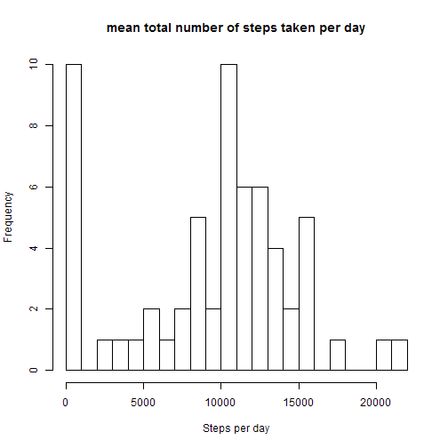
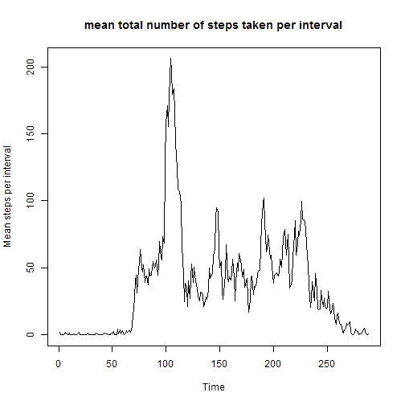

##Loading and preprocessing the data  


```r
activity <- read.csv('activity.csv',na.strings = 'NA',stringsAsFactors = F)
activity$date <- as.Date(activity$date)
activity$interval <- as.factor(activity$interval)
str(activity)
```

```
## 'data.frame':	17568 obs. of  3 variables:
##  $ steps   : int  NA NA NA NA NA NA NA NA NA NA ...
##  $ date    : Date, format: "2012-10-01" "2012-10-01" ...
##  $ interval: Factor w/ 288 levels "0","5","10","15",..: 1 2 3 4 5 6 7 8 9 10 ...
```

```r
Steps_per_day = tapply(activity$steps,activity$date,sum,na.rm =T,simplify = T)
str(Steps_per_day)
```

```
##  int [1:61(1d)] 0 126 11352 12116 13294 15420 11015 0 12811 9900 ...
##  - attr(*, "dimnames")=List of 1
##   ..$ : chr [1:61] "2012-10-01" "2012-10-02" "2012-10-03" "2012-10-04" ...
```

```r
Mean_steps_per_interval = tapply(activity$steps,activity$interval,mean,na.rm=T,simplify = T)
str(Mean_steps_per_interval)
```

```
##  num [1:288(1d)] 1.717 0.3396 0.1321 0.1509 0.0755 ...
##  - attr(*, "dimnames")=List of 1
##   ..$ : chr [1:288] "0" "5" "10" "15" ...
```

##What is mean total number of steps taken per day?  


```r
hist(Steps_per_day,breaks = 20,xlab = 'Steps per day',main = 'mean total number of steps taken per day')
```



```r
mean(Steps_per_day,na.rm = T)
```

```
## [1] 9354.23
```

```r
median(Steps_per_day,na.rm = T)
```

```
## [1] 10395
```

##What is the average daily activity pattern?


```r
plot(Mean_steps_per_interval,type = 'l',xlab = 'Time',ylab = 'Mean steps per interval',main = 'mean total number of steps taken per interval')
```



```r
which.max(Mean_steps_per_interval)
```

```
## 835 
## 104
```

##Imputing missing values  

strategy using mean steps per day to fill in all of the missing values.


```r
sum(is.na(activity$steps))
```

```
## [1] 2304
```

```r
fill <- activity
for(i in 1:dim(fill)[1]){
  if (is.na(fill[i,1])){
    fill[i,1] = Mean_steps_per_interval[as.character(fill[i,3])]
  }
}
Fill_steps_per_day = tapply(fill$steps,fill$date,sum,simplify = T)
hist(Steps_per_day,breaks = 20,xlab = 'Steps per day',main = 'mean total number of steps taken per day\n NA filled')
```


```r
mean(Fill_steps_per_day)
```

```
## [1] 10766.19
```

```r
median(Fill_steps_per_day)
```

```
## [1] 10766.19
```


##Are there differences in activity patterns between weekdays and weekends?

```r
number <- c()
for(i in 1:dim(fill)[1]){
  t <- weekdays(fill[i,2],T)
  if (t %in% c('周六','周日')){
    number <- c(number,'weekend') 
  } else{
    number <- c(number,'weekday')
  }
}
number <- as.factor(number)
add <- cbind(fill,number)
Bi_mean_steps_per_interval = aggregate(add$steps, list(add$interval,add$number), mean)
library(ggplot2)
g <- ggplot(Bi_mean_steps_per_interval,aes(Group.1,x,group=Group.2))+geom_line()+facet_grid(Group.2~.)
g <- g+ labs(x='Time',y='Mean steps per interval',title= 'mean total number of steps taken per interval')
g <- g+theme(axis.text.x=element_text(angle=90,size = 3))
g
```


